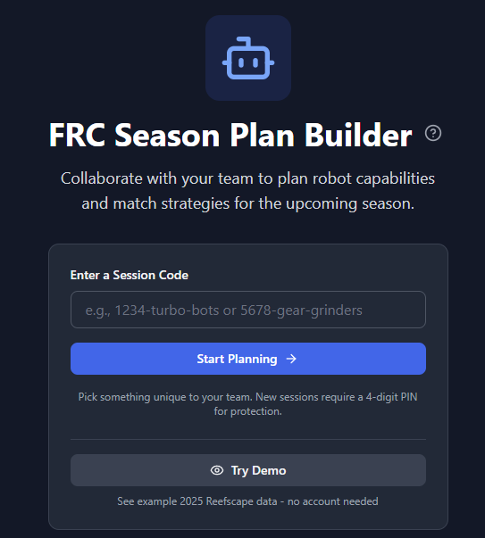
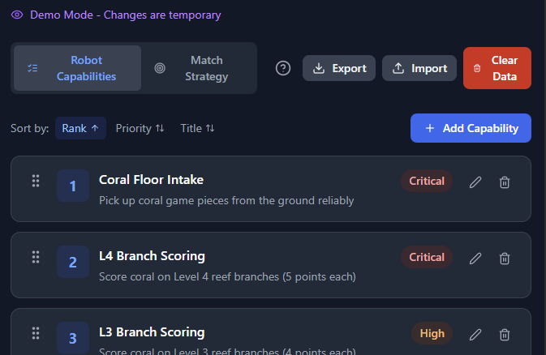
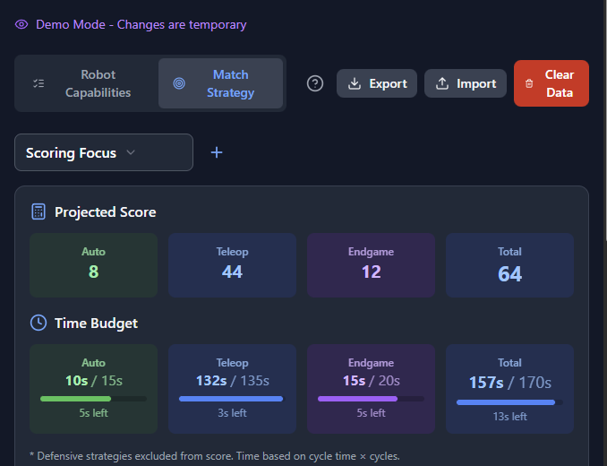
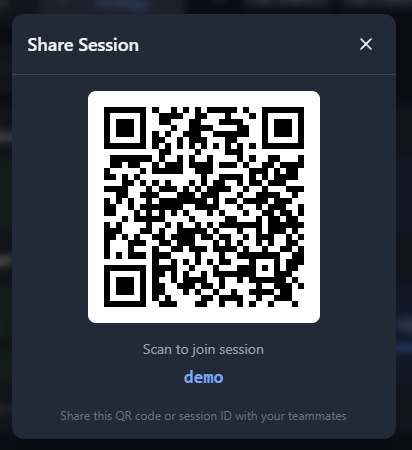

# FRC Season Plan Builder

A collaborative pre-season planning website for FRC/FTC robotics teams to track robot capabilities and match strategies.

## Features

### Robot Capabilities
- Track what your robot should be able to do (intake, scoring, climbing, etc.)
- Prioritize features with drag-and-drop reordering
- Assign point values to each capability
- Sort by priority, points, or title

### Match Strategy
- Plan game execution by match phase (Auto/Teleop/Endgame)
- Track cycle times and expected repetitions
- Calculate projected match scores automatically
- Distinguish between offensive and defensive strategies

### Collaboration
- Create sessions using your team number or custom code
- Share the session code with teammates for real-time collaboration
- Data syncs automatically across all connected users
- Sessions are cached for 30 days

### Data Management
- Export your plan to JSON for backup
- Import previously exported data
- Clear all items with confirmation
- Works offline with localStorage persistence

## Screenshots









## Getting Started

### Prerequisites
- Node.js 18+
- npm

### Installation

1. Clone the repository:
```bash
git clone https://github.com/frcseasonplanbuilder/frcseasonplanbuilder.github.io.git
cd frcseasonplanbuilder.github.io
```

2. Install dependencies:
```bash
npm install
```

3. (Optional) Set up Firebase for real-time collaboration:
   - Create a project at [Firebase Console](https://console.firebase.google.com/)
   - Enable Firestore Database
   - Copy `.env.example` to `.env.local` and fill in your Firebase config

4. Start the development server:
```bash
npm run dev
```

## Firebase Setup (Optional)

Firebase enables real-time collaboration features. Without it, the app works in local-only mode.

1. Create a Firebase project
2. Enable Firestore Database
3. Set up your environment variables:
```env
VITE_FIREBASE_API_KEY=your-api-key
VITE_FIREBASE_AUTH_DOMAIN=your-project.firebaseapp.com
VITE_FIREBASE_PROJECT_ID=your-project-id
VITE_FIREBASE_STORAGE_BUCKET=your-project.appspot.com
VITE_FIREBASE_MESSAGING_SENDER_ID=your-sender-id
VITE_FIREBASE_APP_ID=your-app-id
```

4. Configure Firestore security rules:
```javascript
rules_version = '2';
service cloud.firestore {
  match /databases/{database}/documents {
    match /sessions/{sessionCode} {
      allow read, write: if true;
      match /capabilities/{capabilityId} {
        allow read, write: if true;
      }
      match /strategies/{strategyId} {
        allow read, write: if true;
      }
    }
  }
}
```

5. Set up TTL policy for automatic 30-day cleanup on the `expiresAt` field

## Deployment

The app is configured for GitHub Pages deployment with branch protection.

### Production Deployment

1. Add your Firebase secrets to your repository settings
2. Create a PR to the `main` branch
3. Merge the PR - GitHub Actions will automatically build and deploy

### Branch Naming Convention

**All feature branches must use the `feature/` prefix** to enable test deployments:

- ✅ `feature/add-qr-codes`
- ✅ `feature/fix-session-display`
- ❌ `add-qr-codes` (cannot deploy)
- ❌ `bugfix/something` (cannot deploy)

### Test Deployments

Feature branches can trigger manual deployments for testing:

1. Go to Actions → "Deploy to GitHub Pages"
2. Click "Run workflow"
3. Select your `feature/*` branch
4. The deployment will temporarily update the live site

**Note:** Only `main` and `feature/*` branches are allowed to deploy. After testing, merge to `main` to make changes permanent, or re-run the workflow from `main` to rollback.

## Tech Stack

- **React** + **TypeScript** - UI framework
- **Vite** - Build tool
- **Tailwind CSS** - Styling
- **Zustand** - State management
- **@dnd-kit** - Drag and drop
- **Firebase Firestore** - Real-time database (optional)
- **React Router** - Navigation

## License

MIT

## Credits

Built for FIRST Robotics Competition teams.

Strategy planning inspired by approaches from:
- [Team 254](https://www.team254.com/)
- [Team 1678 Citrus Circuits](https://www.citruscircuits.org/)
- [REV Robotics Documentation](https://docs.revrobotics.com/)
- [Game Manual 0](https://gm0.org/)
